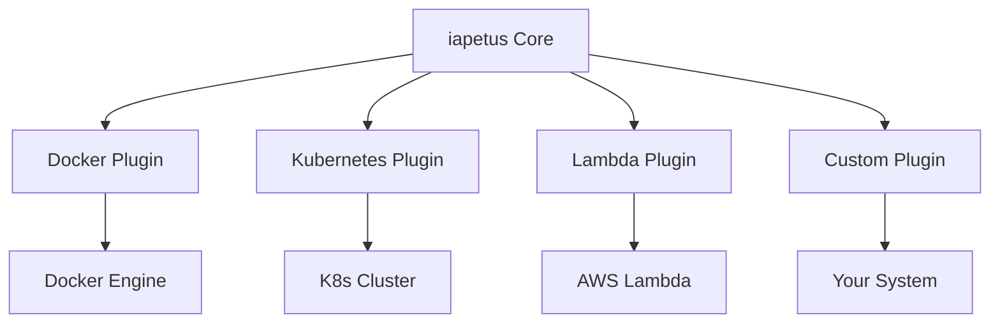

# iapetus 🚀

[](https://pkg.go.dev/github.com/yindia/iapetus)
[](https://goreportcard.com/report/github.com/yindia/iapetus)
[](https://codecov.io/gh/yindia/iapetus)

---

> ⭐ **If you like this project, please [star us on GitHub](https://github.com/yindia/iapetus/stargazers)!**

---

# ⚡ iapetus: The Ultimate Go Workflow Orchestrator

**A robust, extensible Go package for orchestrating and validating command-line workflows with parallel DAG execution, built-in assertions, and advanced observability.**

---

## Table of Contents
- [Why iapetus?](#why-iapetus)
- [Features](#features)
- [Getting Started](#getting-started)
- [Task: Definition & Usage](#task-definition--usage)
- [Workflow: Orchestration & Hooks](#workflow-orchestration--hooks)
- [Assertions: Built-in & Custom](#assertions-built-in--custom)
- [Advanced Features](#advanced-features)
- [Observability & Extensibility](#observability--extensibility)
- [Use Cases: CLI Integration & End-to-End Testing](#use-cases-cli-integration--end-to-end-testing)
- [FAQ](#faq)
- [Roadmap & Upcoming Features](#roadmap--upcoming-features)
- [Contributing](#contributing)
- [Community & Support](#community--support)
- [License](#license)

---

## Why iapetus? 🤔

- **Lightning-fast parallel execution** with dependency-aware DAG scheduling
- **Battle-tested reliability**: stress, property-based, and concurrency tests
- **Pluggable observability**: hooks, metrics, and [zap](https://github.com/uber-go/zap) logging
- **Extensible**: Add your own assertions, hooks, and workflow logic
- **Production-ready**: Used in CI/CD, data pipelines, and cloud automation
- **Developer-friendly**: Fluent builder API, YAML/config support, and rich documentation

---

## ⭐ Features

- ⚡ **Parallel, dependency-aware workflow execution** (DAG-based)
- ✅ **Built-in and custom assertions** for validating outputs
- 🔄 **Retries** for flaky operations
- 🏗️ **Fluent builder pattern** for readable workflow and task construction
- 🔍 **Observability hooks** and pluggable logging
- 🧪 **Battle-tested**: stress, property-based, and concurrency tests
- 🐳 **Container-ready**: Support for specifying container images and environment variables
- 🧩 **Extensible**: Add custom hooks, assertions, and workflow logic

---

## 🚀 Getting Started

### 1. Install iapetus

```sh
go get github.com/yindia/iapetus
```

### 2. Run the Example

We recommend starting with a real example. Clone the repo and run the provided example:

```sh
git clone https://github.com/yindia/iapetus.git
cd iapetus
cd example/docker
# (Optional) Initialize a new Go module if you want to experiment
# go mod init example.com/quickstart
# go mod tidy
# Run the example
GO111MODULE=on go run main.go
```

You should see output from the workflow and task execution. Try editing the command or assertions in `main.go` to see how failures are reported!

---

## 🧩 Task: Definition & Usage

A **Task** represents a single command or operation in your workflow. You can define tasks using struct literals or the fluent builder API.

### Task Fields
- `Name` (string): Unique identifier for the task
- `Command` (string): The command to execute (e.g., `echo`, `curl`)
- `Args` ([]string): Command-line arguments
- `Timeout` (time.Duration): Maximum execution time
- `Retries` (int): Number of retry attempts on failure
- `Depends` ([]string): Names of tasks this task depends on
- `EnvMap` (map[string]string): Alternative env representation
- `Image` (string): Container image (for future containerized runners)
- `Asserts` ([]func(*Task) error): List of assertion functions
- `PreRun`/`PostRun` (func): Hooks for setup/teardown

### Task Examples

#### Struct Literal
```go
task := &iapetus.Task{
    Name:    "verify-service",
    Command: "curl",
    Args:    []string{"-f", "http://localhost:8080"},
    Timeout: 5 * time.Second,
    Retries: 2,
    EnvMap:  map[string]string{"FOO": "bar"},
    Depends: []string{"setup-db"},
    Asserts: []func(*iapetus.Task) error{
        iapetus.AssertExitCode(0),
        iapetus.AssertOutputContains("Success"),
    },
    PreRun: func(t *iapetus.Task) error {
        // Custom setup
        return nil
    },
    PostRun: func(t *iapetus.Task) error {
        // Custom teardown
        return nil
    },
}
```

#### Builder/Fluent API
```go
task := iapetus.NewTask("verify-service", 5*time.Second, nil).
    AddCommand("curl").
    AddArgs("-f", "http://localhost:8080").
    AssertExitCode(0).
    AssertOutputContains("Success").
    AddImage("alpine:3.18").
    AddEnvMap(map[string]string{"FOO": "bar"}).
    SetRetries(2).
    AddAssertion(func(t *iapetus.Task) error {
        if !strings.Contains(t.Actual.Output, "OK") {
            return fmt.Errorf("expected OK in output")
        }
        return nil
    })
```

#### With Hooks and Retries
```go
task := iapetus.NewTask("db-migrate", 10*time.Second, nil).
    AddCommand("sh").
    AddArgs("-c", "./migrate.sh").
    SetRetries(3).
    AddEnv("ENV=prod")
    // Add assertions and hooks as needed
```

---

## 🏗️ Workflow: Orchestration & Hooks

A **Workflow** is a collection of tasks with dependencies, executed in parallel where possible (DAG scheduling).

### Workflow Fields
- `Name` (string): Workflow identifier
- `Steps` ([]Task): List of tasks
- `PreRun`/`PostRun` (func): Workflow-level setup/teardown
- `OnTaskStartHooks`, `OnTaskSuccessHooks`, `OnTaskFailureHooks`, `OnTaskCompleteHooks`: Observability hooks
- `Image`, `EnvMap`: Workflow-wide container/image/env config
- `logger`: Pluggable logger (defaults to zap)

### Workflow Example
```go
workflow := iapetus.NewWorkflow("cluster-setup", zap.NewNop()).
    AddTask(*task1).
    AddTask(*task2).
    AddPreRun(func(w *iapetus.Workflow) error {
        // Setup logic before tasks run
        return nil
    }).
    AddPostRun(func(w *iapetus.Workflow) error {
        // Cleanup logic after all tasks
        return nil
    })

if err := workflow.Run(); err != nil {
    log.Fatalf("Workflow failed: %v", err)
}
```

#### Dependency Management
- Use the `Depends` field in each task to specify dependencies by name.
- The scheduler will execute tasks in parallel where possible, respecting dependencies.

#### Observability Hooks
```go
workflow.AddOnTaskStartHook(func(task *iapetus.Task) { /* ... */ })
workflow.AddOnTaskSuccessHook(func(task *iapetus.Task) { /* ... */ })
workflow.AddOnTaskFailureHook(func(task *iapetus.Task, err error) { /* ... */ })
workflow.AddOnTaskCompleteHook(func(task *iapetus.Task) { /* ... */ })
```

---

## 🧪 Assertions: Built-in & Custom

### Built-in Assertions
- `AssertExitCode(expected int)`: Validates the exit code
- `AssertOutputEquals(expected string)`: Exact string match
- `AssertOutputJsonEquals(expected string, skipJsonNodes ...string)`: JSON comparison
- `AssertOutputContains(substr string)`: Substring presence
- `AssertOutputMatchesRegexp(pattern string)`: Output matches regular expression

### Custom Assertions
```go
task.AddAssertion(func(t *iapetus.Task) error {
    if !strings.Contains(t.Actual.Output, "success") {
        return fmt.Errorf("expected 'success' in output")
    }
    return nil
})
```

### Assertion Chaining (Fluent DSL)
```go
task.Expect().ExitCode(0).OutputContains("foo").Done()
```

---

## 🚦 Advanced Features

- **Retries**: Set `Retries` on a task to automatically retry on assertion failure.
- **Timeouts**: Set `Timeout` for each task to prevent hangs.
- **Container Image**: Use the `Image` field to specify a container image (for future containerized runners).
- **Environment Variables**: Use `Env` (list) or `EnvMap` (map) for environment configuration.
- **PreRun/PostRun Hooks**: Use `PreRun` and `PostRun` for setup/teardown logic at both workflow and task levels.
- **Event-driven Scheduler**: iapetus uses an event-driven, concurrency-safe DAG scheduler for robust parallel execution.

---

## 🔍 Observability & Extensibility

- **Logging**: All events are logged with [zap](https://github.com/uber-go/zap) by default. You can provide your own logger.
- **Hooks**: Register multiple hooks for task start, success, failure, and completion (see above).
- **Custom Extensions**: Add your own assertion functions, hooks, or even custom task runners.
- **YAML/Config Integration**: (Planned) Load workflows from YAML or other config formats for CI/CD and automation.

---

## 🧪 Use Cases: CLI Integration & End-to-End Testing

iapetus is ideal for writing integration and end-to-end (E2E) tests for any CLI tool—whether it's Docker, kubectl, git, terraform, or your own custom CLI. You can:
- Run CLI commands as tasks
- Assert on their output, exit code, or side effects
- Chain commands with dependencies (e.g., setup, test, teardown)
- Run tests in parallel or sequence
- Integrate with CI for robust, automated CLI validation
- Collect and reuse CLI output between tasks
- Test both positive and negative scenarios

### Example: Testing a CLI (e.g., Docker)

```go
import (
    "github.com/yindia/iapetus"
    "go.uber.org/zap"
    "time"
)

task := iapetus.NewTask("docker-version", 5*time.Second, nil).
    AddCommand("docker").
    AddArgs("version").
    AssertExitCode(0).
    AssertOutputContains("Version")

workflow := iapetus.NewWorkflow("docker-cli-test", zap.NewNop()).
    AddTask(*task)

if err := workflow.Run(); err != nil {
    panic(err)
}
```

### Example: E2E Test for a Custom CLI

```go
taskSetup := iapetus.NewTask("setup", 5*time.Second, nil).
    AddCommand("mycli").
    AddArgs("init").
    AssertExitCode(0)

taskRun := iapetus.NewTask("run", 5*time.Second, nil).
    AddCommand("mycli").
    AddArgs("run", "--foo").
    Depends = []string{"setup"}
    AssertOutputContains("success")

taskTeardown := iapetus.NewTask("teardown", 5*time.Second, nil).
    AddCommand("mycli").
    AddArgs("cleanup").
    Depends = []string{"run"}
    AssertExitCode(0)

workflow := iapetus.NewWorkflow("cli-e2e", zap.NewNop()).
    AddTask(*taskSetup).
    AddTask(*taskRun).
    AddTask(*taskTeardown)

if err := workflow.Run(); err != nil {
    panic(err)
}
```

---

### Parallel CLI Tests

You can run multiple CLI tests in parallel by omitting dependencies:

```go
tasks := []*iapetus.Task{
    iapetus.NewTask("git-version", 3*time.Second, nil).
        AddCommand("git").AddArgs("--version").AssertOutputContains("git version"),
    iapetus.NewTask("kubectl-version", 3*time.Second, nil).
        AddCommand("kubectl").AddArgs("version", "--client").AssertOutputContains("Client Version"),
    iapetus.NewTask("terraform-version", 3*time.Second, nil).
        AddCommand("terraform").AddArgs("version").AssertOutputContains("Terraform v"),
}
workflow := iapetus.NewWorkflow("cli-parallel", zap.NewNop())
for _, t := range tasks {
    workflow.AddTask(*t)
}
if err := workflow.Run(); err != nil {
    panic(err)
}
```

---

### Table-Driven CLI Tests

You can use Go's table-driven style to test many CLI commands with different arguments and assertions:

```go
testCases := []struct {
    name    string
    command string
    args    []string
    want    string
}{
    {"echo-hello", "echo", []string{"hello"}, "hello"},
    {"echo-world", "echo", []string{"world"}, "world"},
}
workflow := iapetus.NewWorkflow("table-driven", zap.NewNop())
for _, tc := range testCases {
    t := iapetus.NewTask(tc.name, 2*time.Second, nil).
        AddCommand(tc.command).
        AddArgs(tc.args...).
        AssertOutputContains(tc.want)
    workflow.AddTask(*t)
}
if err := workflow.Run(); err != nil {
    panic(err)
}
```

---

### Multi-CLI Orchestration

You can orchestrate multiple CLI tools in a single workflow, with dependencies:

```go
taskDocker := iapetus.NewTask("docker-info", 5*time.Second, nil).
    AddCommand("docker").AddArgs("info").AssertOutputContains("Containers")
taskKubectl := iapetus.NewTask("kubectl-ns", 5*time.Second, nil).
    AddCommand("kubectl").AddArgs("get", "ns").AssertExitCode(0)
taskTerraform := iapetus.NewTask("terraform-help", 5*time.Second, nil).
    AddCommand("terraform").AddArgs("help").AssertOutputContains("Usage")
taskSummary := iapetus.NewTask("summary", 2*time.Second, nil).
    AddCommand("echo").AddArgs("All CLI checks passed!").
    Depends = []string{"docker-info", "kubectl-ns", "terraform-help"}
workflow := iapetus.NewWorkflow("multi-cli", zap.NewNop()).
    AddTask(*taskDocker).
    AddTask(*taskKubectl).
    AddTask(*taskTerraform).
    AddTask(*taskSummary)
if err := workflow.Run(); err != nil {
    panic(err)
}
```

---

### Dynamic Assertions & Output Reuse

You can use hooks or custom assertions to capture CLI output and use it in later tasks:

```go
var dockerVersion string
task := iapetus.NewTask("docker-version", 5*time.Second, nil).
    AddCommand("docker").AddArgs("version", "--format", "{{.Server.Version}}")
workflow := iapetus.NewWorkflow("dynamic-assert", zap.NewNop())
workflow.AddOnTaskSuccessHook(func(t *iapetus.Task) {
    if t.Name == "docker-version" {
        dockerVersion = t.Actual.Output
    }
})
workflow.AddTask(*task)
// Add more tasks that use dockerVersion as needed
if err := workflow.Run(); err != nil {
    panic(err)
}
```

---

### Testing Error Cases & Negative Scenarios

You can assert on error output, non-zero exit codes, or expected failures:

```go
task := iapetus.NewTask("fail-case", 2*time.Second, nil).
    AddCommand("ls").AddArgs("/nonexistent").
    AssertExitCode(1).
    AddAssertion(func(t *iapetus.Task) error {
        if !strings.Contains(t.Actual.Output, "No such file or directory") {
            return fmt.Errorf("expected error message not found")
        }
        return nil
    })
workflow := iapetus.NewWorkflow("negative-test", zap.NewNop()).AddTask(*task)
if err := workflow.Run(); err != nil {
    fmt.Println("Expected failure detected:", err)
}
```

---

### Using Hooks for Custom Logging or Metrics

You can use hooks to collect logs, metrics, or trigger custom actions on task events:

```go
workflow := iapetus.NewWorkflow("hook-logging", zap.NewNop())
workflow.AddOnTaskStartHook(func(t *iapetus.Task) {
    fmt.Printf("Starting task: %s\n", t.Name)
})
workflow.AddOnTaskSuccessHook(func(t *iapetus.Task) {
    fmt.Printf("Task succeeded: %s\n", t.Name)
})
workflow.AddOnTaskFailureHook(func(t *iapetus.Task, err error) {
    fmt.Printf("Task failed: %s, error: %v\n", t.Name, err)
})
// Add tasks as usual
```

---

### Example: iapetus in a CI Pipeline (GitHub Actions)

```yaml
name: CLI Integration Test
on: [push, pull_request]
jobs:
  test:
    runs-on: ubuntu-latest
    steps:
      - uses: actions/checkout@v4
      - name: Set up Go
        uses: actions/setup-go@v4
        with:
          go-version: '1.21'
      - name: Install dependencies
        run: go mod tidy
      - name: Run CLI E2E tests
        run: go test ./...
```

---

**iapetus supports any CLI tool that can be invoked from Go—Docker, kubectl, git, terraform, helm, your own binaries, and more!**

---

## ❓ FAQ

### Where should I use iapetus?
- **CI/CD pipelines**: Automate build, test, and deployment workflows with complex dependencies.
- **Data pipelines**: Orchestrate ETL, validation, and reporting steps.
- **DevOps automation**: Run infrastructure checks, smoke tests, and environment setup.
- **Local developer automation**: Script repeatable local workflows with assertions and parallelism.
- **Anywhere you need robust, parallel, dependency-aware task execution in Go!**

### How does iapetus compare to other workflow tools?
- **Go-native**: No YAML/DSL required (but planned for future). Full type safety and IDE support.
- **Extensible**: Add custom logic, assertions, and hooks in Go.
- **Event-driven, concurrency-safe**: No goroutine leaks, robust error handling.
- **Integrates with your Go codebase**: No external engine or server required.

### How do I run all commands in an isolated environment?
- **With pixi:**
  ```sh
  pixi shell
  pixi run go test ./...
  pixi run golangci-lint run ./...
  ```
- **With Docker:**
  ```sh
  docker run --rm -it -v $(pwd):/app -w /app golang:1.21 bash
  go test ./...
  golangci-lint run ./...
  ```

### Can I use iapetus for cloud-native workflows?
- Yes! iapetus is designed to be extensible. Upcoming plugin systems will let you:
  - Run tasks in Docker containers
  - Orchestrate jobs on Kubernetes
  - Trigger and manage AWS Lambda or other FaaS systems
  - Integrate with CI/CD, cloud, and on-prem systems

### How does iapetus handle failures and retries?
- Each task can specify a `Retries` count. If a task fails (due to command error or assertion failure), it will be retried up to the specified number of times.
- If a task fails after all retries, the workflow will fail fast and propagate the error.
- You can add custom error handling logic via hooks.

### Can I visualize my workflows?
- Visualization is on the roadmap! Planned features include a web UI and dashboard for real-time workflow status and DAG visualization.
- For now, you can log workflow execution and use the observability hooks to export events to your own tools.

### How do I contribute a plugin or integration?
- The upcoming plugin system will provide clear interfaces for adding new runners, integrations, and backends (e.g., Docker, Kubernetes, Lambda).
- Contributions are welcome! See the [Contributing](#contributing) section and open an issue or discussion to propose your plugin idea.

### Is iapetus suitable for production?
- Yes! iapetus is designed for reliability, concurrency safety, and extensibility. It is tested with property-based and stress tests.
- However, APIs may evolve as the plugin system and config features mature. Please pin versions and review changelogs for breaking changes.

### How do I debug or trace workflow execution?
- All task and workflow events are logged with [zap](https://github.com/uber-go/zap) by default.
- You can add hooks for custom logging, metrics, or tracing (e.g., OpenTelemetry).
- Planned features include native tracing and metrics export.

---

## 🚧 Roadmap & Upcoming Features

- **Plugin System**: Seamlessly connect iapetus to Docker, Kubernetes, Lambda, and other platforms.
- **YAML/Config Integration**: Define workflows declaratively for CI/CD and automation.
- **Web UI & Dashboard**: Visualize workflow execution and status.
- **Metrics & Tracing**: Native support for Prometheus, OpenTelemetry, etc.
- **More built-in assertions and integrations**
- **Community-driven features**: Suggest your own!

### 🔌 Plugin System Vision



- **iapetus Core**: Handles DAG scheduling, assertions, and orchestration logic
- **Plugins**: Implement task runners for Docker, Kubernetes, Lambda, or your own systems
- **Easy Integration**: Just add your plugin and configure your workflow to use it

---

## 🤝 Contributing

We welcome contributions! Help us make iapetus the best workflow orchestrator in Go:

### Development Environment Setup

1. **Install [pixi](https://pixi.sh/):**
   - Follow the instructions at https://pixi.sh/ to install pixi on your system.

2. **Enter the development environment:**
   - Run:
     ```sh
     pixi shell
     ```
   - This will drop you into a shell with all dependencies and tools available.

3. **Run development commands with the `pixi` prefix:**
   - For example, to run tests:
     ```sh
     pixi run go test ./...
     ```
   - To run linters:
     ```sh
     pixi run golangci-lint run ./...
     ```

4. **Standard Go commands also work inside `pixi shell`.**

### Code Style & PR Guidelines

- Follow idiomatic Go style (`gofmt`, `golangci-lint`)
- Write clear, descriptive commit messages (conventional commits preferred)
- Add/maintain unit tests for all features and bugfixes
- Document public APIs with GoDoc comments
- Open issues for bugs, features, or improvements
- Be kind and constructive in code reviews and discussions

---

## 🌎 Community & Support

- **Issues:** [File a bug or feature request](https://github.com/yindia/iapetus/issues)
- **Discussions:** [Join the conversation](https://github.com/yindia/iapetus/discussions)
- **Pull Requests:** [Contribute code or docs](https://github.com/yindia/iapetus/pulls)
- **Questions?** Open a discussion or reach out via issues!

---

## 📜 License

[MIT](LICENSE)

---

> ⭐ **If you find iapetus useful, please [star the repo](https://github.com/yindia/iapetus/stargazers) and share it with your friends and colleagues!**
