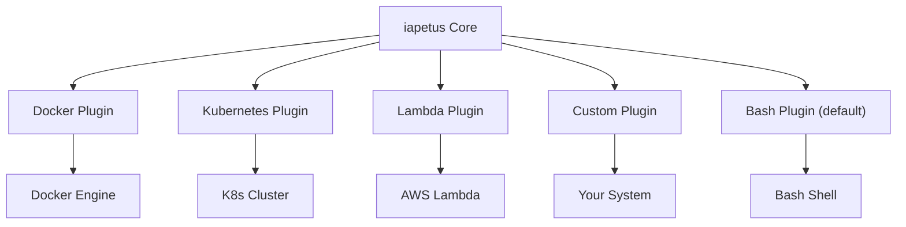

# iapetus 🚀  
**The Ultimate Open Source Workflow Orchestrator for CLI, DevOps, and CI/CD**

[](https://pkg.go.dev/github.com/yindia/iapetus)
[](https://goreportcard.com/report/github.com/yindia/iapetus)
[](https://codecov.io/gh/yindia/iapetus)
[](LICENSE)
[](https://github.com/yindia/iapetus/pulls)

---

> **Automate, test, and orchestrate anything that runs in a shell, container, or cloud.**  
> **No YAML hell. No vendor lock-in. 100% open source.**

---

## ✨ What is iapetus?

**iapetus** is a blazing-fast, extensible workflow engine for automating command-line tasks, DevOps pipelines, and end-to-end tests.  
It's like GitHub Actions, but local, hackable, and embeddable in your Go code or CI.

- **Run any CLI tool** (docker, kubectl, terraform, your scripts)
- **Chain steps with dependencies** (DAG, not just linear)
- **Assert on outputs, exit codes, JSON, and more**
- **Run steps in parallel, in containers, or on your host**
- **Write workflows in YAML or Go**
- **Plug in your own backends, hooks, and assertions**

---

## 🚀 Demo


*Run complex workflows, see real-time results, and catch errors instantly!*

---

## 🏆 Why iapetus?

- **Lightning-fast**: Parallel, dependency-aware execution
- **Battle-tested**: Stress, property-based, and concurrency tests
- **Pluggable**: Add your own backends (Docker, Kubernetes, Lambda, ...)
- **Observability**: Built-in logging, hooks, and metrics
- **Zero lock-in**: 100% open source, no cloud required
- **Dev-friendly**: Fluent Go API, YAML config, and rich docs

---

## 🔥 Real-World Use Cases

- **CI/CD pipelines**: Automate builds, tests, and deployments
- **DevOps automation**: Smoke tests, environment setup, health checks
- **E2E testing**: Validate CLI tools, microservices, and APIs
- **Data pipelines**: Orchestrate ETL, validation, and reporting
- **Local developer automation**: Script repeatable workflows

---

## ⚡️ 1-Minute Quickstart

**No Go experience needed!**

```sh
git clone https://github.com/yindia/iapetus.git
cd iapetus/example/yaml
go run main_docker.go
```

**What you'll see:**  
- Each step runs in a container, output is checked, and results are shown in real time.

---

## 📝 Example Workflow (YAML)

```yaml
name: hello-world
steps:
  - name: say-hello
    command: echo
    args: ["Hello, iapetus!"]
    raw_asserts:
      - output_contains: iapetus
```

---

## 🧑‍💻 Example Workflow (Go)

```go
task := iapetus.NewTask("say-hello", 2*time.Second, nil).
    AddCommand("echo").
    AddArgs("Hello, iapetus!").
    AssertOutputContains("iapetus")
workflow := iapetus.NewWorkflow("hello-world", zap.NewNop()).AddTask(*task)
workflow.Run()
```

---

## 🧩 Features

- **Parallel, dependency-aware execution** (DAG)
- **Built-in & custom assertions** (exit code, output, JSON, regex, ...)
- **Retries, timeouts, env vars, container images**
- **Plugin backends**: Bash, Docker, and more
- **Hooks for logging, metrics, and custom logic**
- **YAML or Go: your choice**
- **Battle-tested: stress, property-based, and concurrency tests**
- **Beautiful logs and error reporting**

---

## 🔌 Extensible Plugin System

- **Backends**: Run tasks in bash, Docker, or your own system
- **Assertions**: Add custom checks for any output
- **Hooks**: Integrate with metrics, tracing, or notifications

---

## 🏗️ Architecture



---

## 📚 Learn More

- [Usage Guide](USAGE.md)
- [API & YAML Reference](REFERENCE.md)
- [Full GoDoc](https://pkg.go.dev/github.com/yindia/iapetus)
- [YAML Example](example/yaml/workflow_docker.yaml)
- [Go API Example](example/docker/main.go)
- [FAQ](#faq)
- [Contributing Guide](CONTRIBUTING.md)

---

## 🤝 Join the Community

- [Discussions](https://github.com/yindia/iapetus/discussions)
- [Issues](https://github.com/yindia/iapetus/issues)

---

## ⭐️ Star iapetus!

If you love iapetus, **please [star the repo](https://github.com/yindia/iapetus/stargazers)** and share it with your friends and colleagues!

---

## 🛠️ Contributing

We welcome PRs, issues, and feedback!  
See [CONTRIBUTING.md](CONTRIBUTING.md) for how to get started.

---

## 📜 License

MIT

---

### [⬆️ Back to top](#iapetus-)
